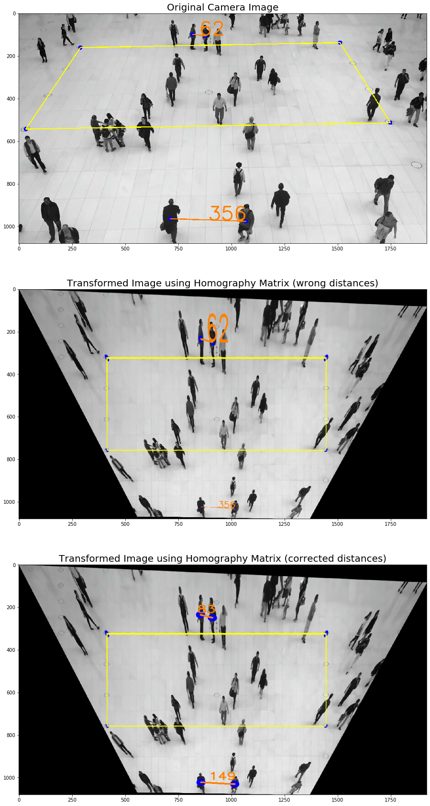
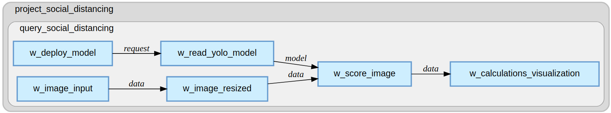

# Tracking Social Distancing Using Computer Vision

    

## Overview

Due to the current Corona crisis, several governments have decided to implement restrictions for social distance. While most people follow these guidelines, there are still people who ignore them for various reasons.

The overall goal of this project is to identify objects (i.e., people) who are following social distancing guidelines and those who are not. This is accomplished by way of the following:

*  Transform images and object coordinates into a two-dimensional map if a homography matrix was provided
*  Calculate real world distances between detected objects if a homography matrix was provided. Otherwise use distances from the image directly.
*  Detect crowds that exceed a specified parameter
*  Visualize the results on the camera image

### Object Detection

The first step in the process is to detect people in images. A Tiny Yolo V2 model was used for this task, but any detection model would work. The decision to use Tiny Yolo V2 was mainly driven because of its ease to use in SAS. The training process for object detection is included in this Jupyter Notebook.

### Transforming the Image and Calculating Distance

The second step is calculate the distances between all objects. While this may sound simple, it is actually more complicated if you think about it. Normally a camera does not provide a top view. Instead it is at some angle which leads to certain perspective. This perspective can be very important when you calculate real world distances in images. The following three pictures illustrate the transformation process.

The second image shows the results after transforming the image using a Homography Matrix. A rectangle was able to be formed, but the distances are incorrect due to the camera's perspective. The third image show the results after a transformation matrix was applied. A distance of 356 pixels on the image shrinks to 149 pixels while a distance of 62 pixels in the other direction are 83 pixels in reality. For more information, refer to the [Concepts of Homography](https://docs.opencv.org/master/d9/dab/tutorial_homography.html).

### Identifying Crowds

Now that we have detected people and transformed the distances between them we want to determine whether we have crowds in our image. In this demonstration, KD-Trees from Scipy was used to look up  nearest neighbors given a detected person and a maximum radius. The following functions were used:

* [cKDTree](https://docs.scipy.org/doc/scipy/reference/generated/scipy.spatial.cKDTree.html) to efficiently calculate nearest neighbors.
* [query_ball_tree](https://docs.scipy.org/doc/scipy/reference/generated/scipy.spatial.cKDTree.query_ball_tree.html#scipy.spatial.cKDTree.query_ball_tree) to query the KDTree with a person and a given maxium radius.

### Streaming Process

The streaming process uses [SAS Event Stream Processing](https://www.sas.com/en_us/software/event-stream-processing.html) (ESP) and can connect to any video data source. ESP lets you define the process either graphically or programmatically via a [Python Interface](https://github.com/sassoftware/python-esppy).

The following diagram illustrates the streaming process:

The top two boxes load the trained Tiny YOLO V2 model and provide the model to the scoring window. The scoring window receives images that are resized to appropriate dimensions (416x416 pixels in this case). The scoring window provides the detected persons and their corresponding x, y, width, and height values.

The last box utilizes the Python inside SAS Event Stream Processing to transform the coordinates given the homography matrix. Additionally it uses Scipy to perform crowd detection.

The final result looks as follows:

### Code Examples

#### Training

The training portion of the project is included in Jupyter Notebook [social_distancing_yolo_training.ipynb](files/training/social_distancing_yolo_training.ipynb). It creates a Tiny YOLO V2 model named [Tiny-Yolov2.astore](files/training/Tiny-Yolov2.astore).

#### Scoring

The scoring portion of the project is included in Jupyter Notebook [social_distancing.ipynb](files/training/social_distancing.ipynb). It utilizes two input files:

* [Tiny-Yolov2.astore](files/training/Tiny-Yolov2.astore)
* [social_distancing.py](files/scoring/social_distancing.py)

### Prerequisites

* [SAS Event Stream Processing 6.2](https://go.documentation.sas.com/?cdcId=espcdc&cdcVersion=6.2&docsetId=espov&docsetTarget=home.htm&locale=en)
* [ESPPy](https://github.com/sassoftware/python-esppy)
* [JupyterLab](https://jupyter.org/)

### Reference Files

The training portion of the project requires training images and the scoring protion requires videos as input. They can be found at this [GitHub](https://github.com/Mentos05/SAS_DeepLearning/tree/master/Social%20Distancing%20Demo) site.  

### Examples

## Contributing

> We welcome your contributions! Please read [CONTRIBUTING.md](CONTRIBUTING.md) for details on how to submit contributions to this project. 

## License

> This project is licensed under the [Apache 2.0 License](LICENSE).

## Additional Resources

* [SAS Event Stream Processing 6.2 Documentation](https://go.documentation.sas.com/?cdcId=espcdc&cdcVersion=6.2&docsetId=espov&docsetTarget=home.htm&locale=en)
* [ESPPy](https://github.com/sassoftware/python-esppy)
* [JupyterLab](https://jupyter.org/)

